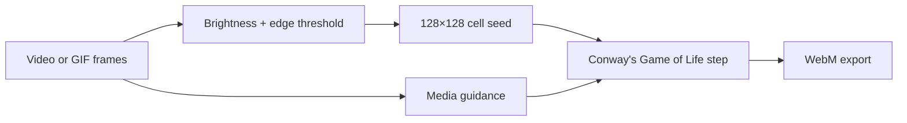

# 128×128 Video Pixeler

Turn a short video or GIF sequence into a crisp 128×128 black-and-white cellular animation in the browser.

Pixeler combines each source frame with Conway's Game of Life. The result contains exactly 16,384 binary cells per frame and exports as a WebM of up to ten seconds.

## Try it

Open `index.html` in Chrome or Edge—there is no build step and no server dependency.

1. Choose a video or up to four animated GIFs.
2. Adjust guidance, threshold, and shape density.
3. Preview the simulation.
4. Export a WebM or a synchronized four-way comparison.

The repository includes a [sample flower video](sample-flower.mp4), an [example GIF](sample-test.gif), and a [generated WebM](simple-video.mp4).

## How it works

- **Video guidance** controls how strongly each generation is pulled toward the source frame. At 0%, the video supplies only the initial seed; at 100%, output follows the thresholded source.
- **Auto threshold** combines brightness and local edge contrast to preserve outlines and internal detail.
- **Shape density** targets the percentage of live cells; 25–35% usually produces lively patterns.
- **Auto-tune density** adapts to frame complexity and smooths changes to reduce flicker.
- Multiple GIFs are chained in order and time-fitted into the ten-second output.

## Why this project

The tool explores a useful middle ground between literal pixelation and autonomous cellular art: the source remains recognizable, but every frame is also a valid Life generation.

## Implementation

The application is dependency-free HTML and JavaScript. Rendering and export happen locally in the browser using canvas and browser media APIs.
